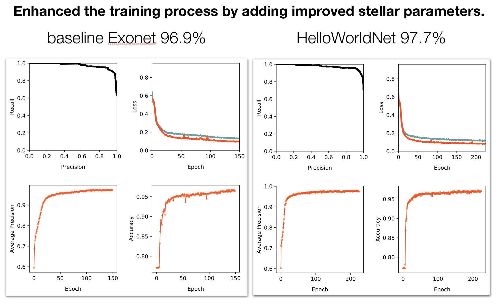

# HelloWorldNet

*fig credit: Chris Shallue*

HelloWorldnet is a modified version of [Exonet](https://gitlab.com/frontierdevelopmentlab/exoplanets/exonet-pytorch), which is in turn a modified version of [Astronet](https://github.com/tensorflow/models/tree/master/research/astronet)

This work is a direct result of the [2019 PyTorch Summer Hackathon](https://info.devpost.com/pytorchmpkrules), hosted at Facebook HQ, with team members:

- [Gully](https://github.com/gully)
- [Grant](https://github.com/GrantRVD) ([twitter](https://twitter.com/usethespacebar))
- [Humayun](https://github.com/humayun)

Our goal is to apply PyTorch to improve the speed and reliability of detecting exoplanets in [lightcurve](https://imagine.gsfc.nasa.gov/features/yba/M31_velocity/lightcurve/lightcurve_more.html) data. Specifically, we're attempting to

- extend Exonet and Astronet for better precision and recall
- creating dataloaders for various data sources, such as Kepler, TESS, and K2
- exploring model architectures to improve transfer learning between exoplanet monitoring and detection tasks

### Performance Benchmark

| Model | Avg. Precision |
| --  | -- |
|Astronet (TensorFlow) | 0.955|
|Exonet (PyTorch) Replication| 0.969|
|Exonet (PyTorch) Reported (Ansdell et al. (2018))| 0.980 |
|**HelloWorldNet (PyTorch Hackathon)**| **0.977**|

### Finding planets is a needle in a haystack problem

</img>

### Neural networks can distinguish rare exoplanets from spurious astrophysical signals

We used data from the Gaia Mission Data Release 2 to improve our knowledge of the stars, making the model more accurate and precise.

### Training Performance

